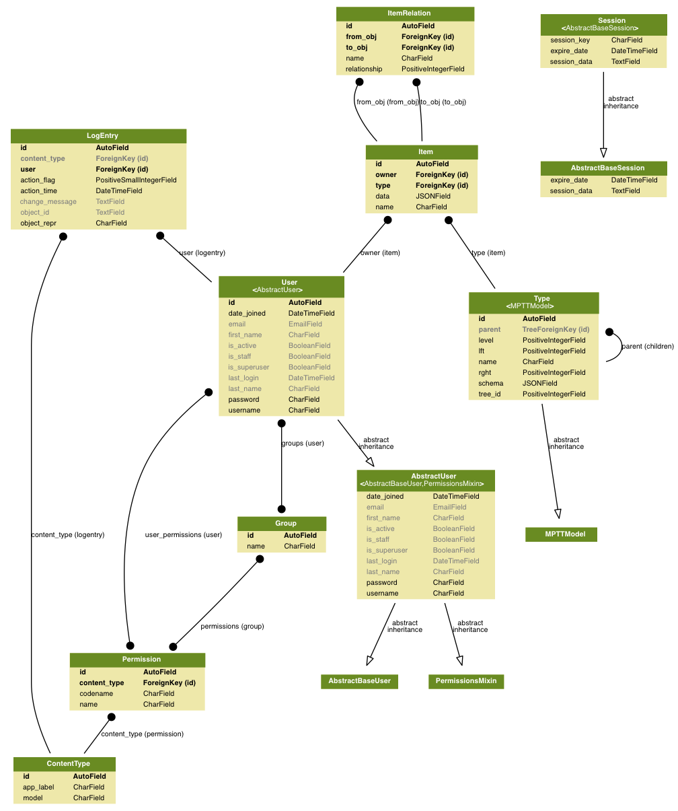

Design Considerations
=====================

Graph DB vs Postgres vs NoSQL
-----------------------------

Not really any need for NoSQL such as Mongo. Postgres would be a better choice with its jsonb field. Query performance might be slightly slower on Postgres jsonb but the benefits of also having a relational DB outweigh this.

A lot of the data is linked so a Graph DB would suit this. The same effect can be achieved in a relational DB and because linking doesn't seem to be very deep, and the amount of data is quite small, the performance hit should be quite small. If we use a user/auth/permission model from a framework such as Django, a relational DB would be required in addition, and a custom lib may need to be created depending on the choice of Graph DB. A graph DB would also not benefit from any of the features of our Template deploy such as backups, encryption etc. and custom deployment would need to be created.

This leaves Postgres as the initial choice for prototyping.

(It might be worth prototyping Airtable as a data store and creating an interface which uses its api. We would need to create out own auth/permissions etc in a separate DB)

Dango Rest Framework
--------------------

Django Rest Framework has been used to create an API for all the data. This has been done with the idea of maybe making the data available to other applications at some stage.

Elasticsearch
-------------

Elastic search has been used mainly for its faceted search. Although the search functionality will be fairly simple it is more difficult to get faceted search through DB queries. It is also fairly easy to set up Elasticsearch.

Authentication
--------------

For now we are using Oauth2 for authentication. In the future we will probably switch to OIDC/Oauth provider such as Auth0 for single sign on. The API is available read-only for non authenticated users but is restricted by ip.

There are three types of permission groups

Standard:
Can add items and update/delete items that that they hav added or are an owner of.

Editor:
Can add, edit and delete any item.

User admin:
Can edit users, user permissions and groups.

2017-05-09
----------

Initially starting with a very loose data structure to try to accommodate for very different structures across different data sets. Once we have more data stored we can decide if and what we need to structure more definitively.

There 'may' be a user need for an administrator or superuser to to define necessary attributes across different data types without the need for application development/release.

Each attribute should have a data type.

There will most likely be a need to search/filter on attributes for each Item.

Items may need to link to other items in many-to-many, one-to-many, many-to-one and one-to-one relationships.

Item Types (eg Software, API etc.) may need to be nested in a tree structure. (Other option is a flat list of tags)

An 'Owner' can be considered to be someone who is a user of the system and will therefore have a user account or one will be created.

2017-06-18
----------

There is no longer a need for users to define attributes or update the item schema. The schema and attributes will be defined in code as database columns. Any updates to schema will require a DB migration to add new fields.

Latest Graphviz model structure
-------------------------------

2017-08-09
----------

After a discussion it has been decided to use Elasticsearch (ES) just for the list and search page.

We can continue to use idiomatic Django and best practices with the postgres database (DB) backend, leveraging class based views (CBV) and mixins etc.

The link between ES and the DB can be maintained by indexing DB ids or in some instances indexing a slug then using that as the lookup field - which eliminates indexing of superfluous postgres DB data and enables the use of standard django CBV.