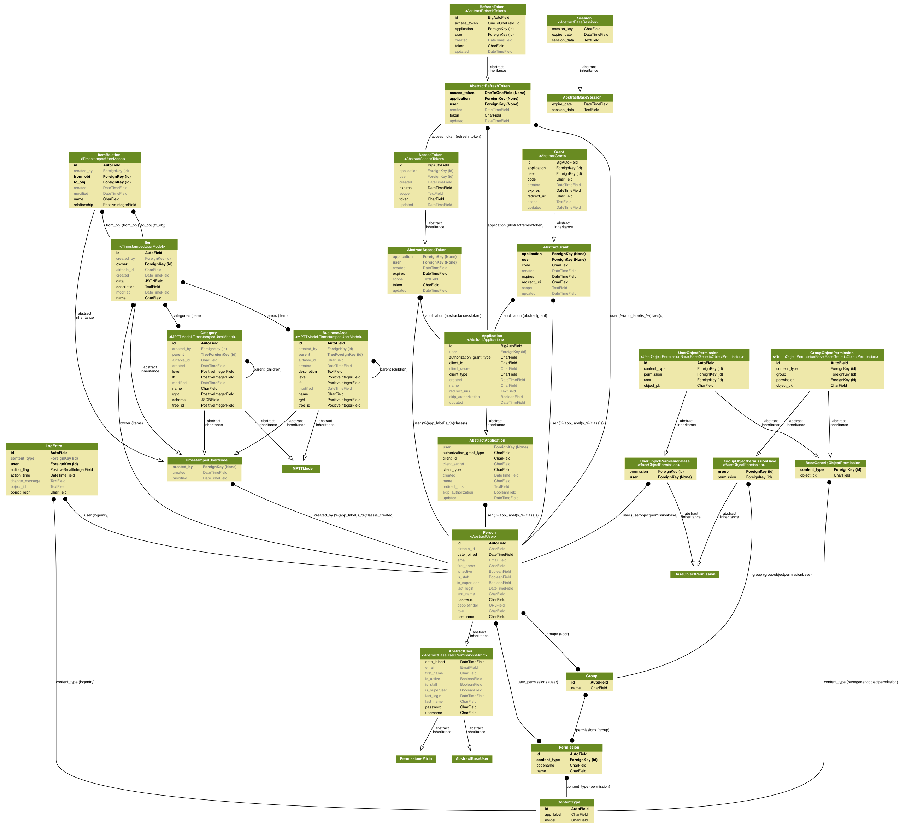

Design Considerations
=====================

Graph DB vs Postgres vs NoSQL
-----------------------------

Not really any need for NoSQL such as Mongo. Postgres would be a better choice with its jsonb field. Query performance might be slightly slower on Postgres jsonb but the benefits of also having a relational DB outweigh this.

A lot of the data is linked so a Graph DB would suit this. The same effect can be achieved in a relational DB and because linking doesn't seem to be very deep, and the amount of data is quite small, the performance hit should be quite small. If we use a user/auth/permission model from a framework such as Django, a relational DB would be required in addition, and a custom lib may need to be created depending on the choice of Graph DB. A graph DB would also not benefit from any of the features of our Template deploy such as backups, encryption etc. and custom deployment would need to be created.

This leaves Postgres as the initial choice for prototyping.

(It might be worth prototyping Airtable as a data store and creating an interface which uses its api. We would need to create out own auth/permissions etc in a separate DB)

2017-05-09
----------

Initially starting with a very loose data structure to try to accommodate for very different structures across different data sets. Once we have more data stored we can decide if and what we need to structure more definitively.

There 'may' be a user need for an administrator or superuser to to define necessary attributes across different data types without the need for application development/release.

Each attribute should have a data type.

There will most likely be a need to search/filter on attributes for each Item.

Items may need to link to other items in many-to-many, one-to-many, many-to-one and one-to-one relationships.

Item Types (eg Software, API etc.) may need to be nested in a tree structure. (Other option is a flat list of tags)

An 'Owner' can be considered to be someone who is a user of the system and will therefore have a user account or one will be created.

Latest Graphviz model structure
-------------------------------

